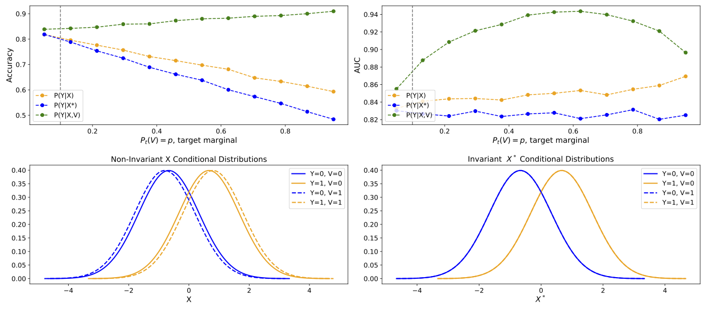
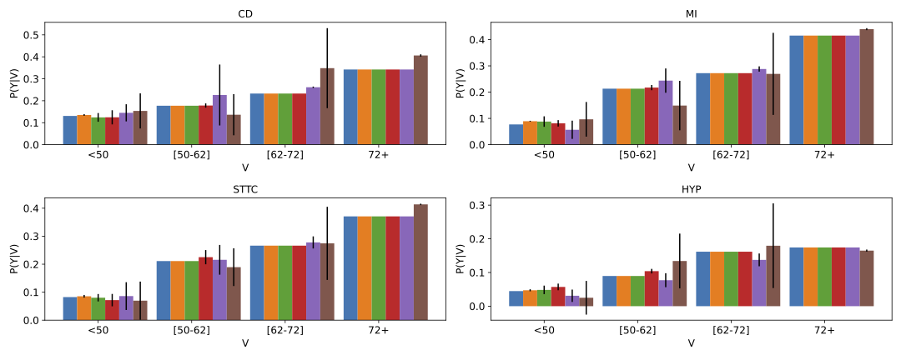
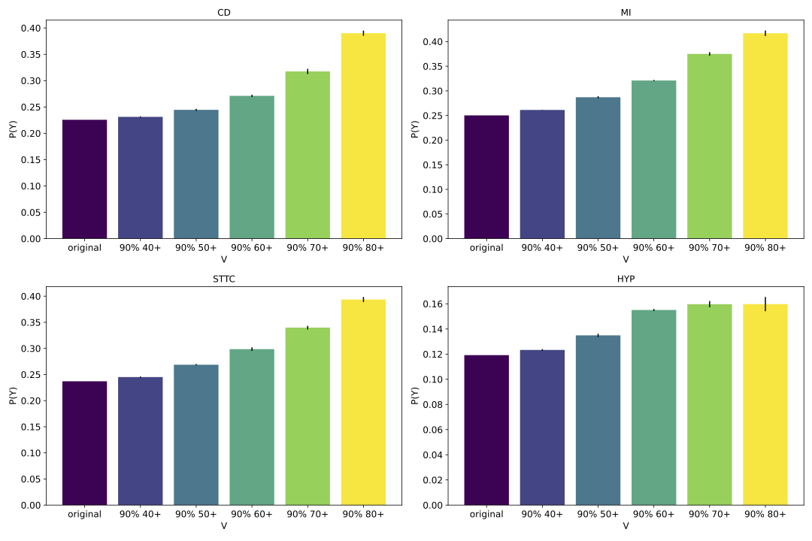

# Reproducing "Considerations for Distribution Shift Robustness in Health"

This repository contains code for reproducing the experiments from 'A. Blaas, A. Miller, L. Zappella, J.-H. Jacobsen, and C. Heinze-Deml, “Considerations for distribution shift robustness in health,” in *ICLR 2023 Workshop on Trustworthy Machine Learning for Healthcare, 2023.*' . The goal is to replicate the key experiments and results presented in the paper.

## Contents
- `synthetic_simulation_study.ipynb`: This Jupyter notebook reproduces the synthetic experiments from the paper, resulting in this plot:

- `investigate_causality.ipynb`: This Jupyter notebook reproduces experiments from the appendix of the paper. It plots the distributions P(Y) and P(Y|V) under distribution shifts of V. When V=age, it looks the following:

